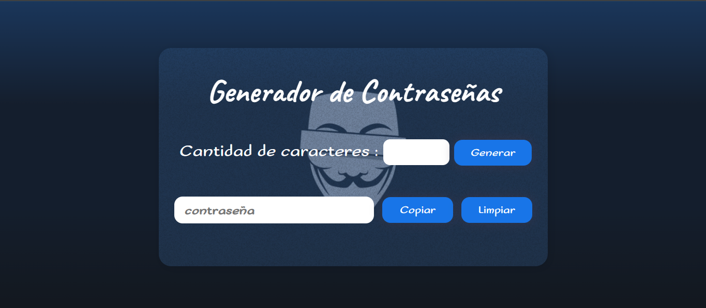

# Generador de contraseña | Alura

     

    
    
    

# Descripción

 Este proyecto es una aplicacion creada en Css, Hmtl y Javascript.
 Esta aplicacion se basa en un generador de contraseñas aleatorio en el cual la persona podra ingresar un numero de caracteres y el sistema arrojara la contraseña con la cantidad de caracteres solicitados.

## clave

"ABCDEFGHIJKLMNOPQRSTUVWXYZabcdefghijklmnopqrstuvwxyz0123456789!@#$%^&*()"
